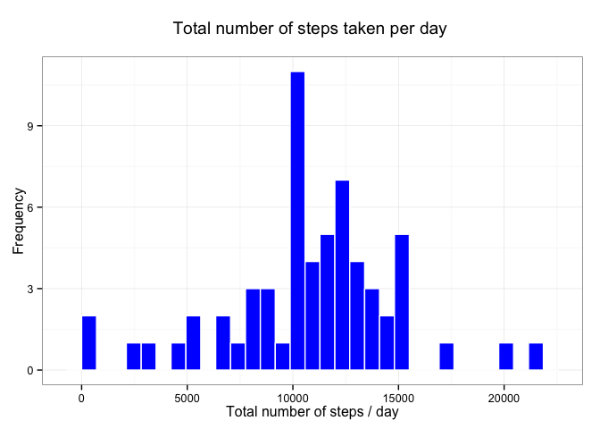

# Reproducible Research: Peer Assessment 1

## Loading and preprocessing the data

**1 Loading the data:**


```r
#Loading libraries
library(data.table)
library(ggplot2)

#Extracting and loading data into activityData dataframe
activityData <- read.csv(unz("./activity.zip", "activity.csv"))
```

**2 Processing data:**


```r
# Setting data types
activityData$date <- as.Date(as.character(activityData$date),"%Y-%m-%d")

# Adding new columns
# Adding "weekday" column
activityData$weekday <- weekdays(activityData$date)

# "activityData" as "data.table"
activityData <- data.table(activityData,
                           key=c("date","interval","weekday"))
```

## What is mean total number of steps taken per day?

**1 Histogram: total number of steps taken each day**


```r
# Aggregating steps by date
stepsByDay <- activityData[,j=list(totalsteps=sum(steps, na.rm = TRUE))
                           ,by="date"]
# Histogram:
plot1 <- ggplot(stepsByDay,
               aes(totalsteps))

plot1 + geom_histogram(fill="blue", color="white") + 
    theme_bw() + 
    labs(x="Total number of steps / day",
         y = "Frequency",
         title = "Total number of steps taken per day \n")
```

```
## stat_bin: binwidth defaulted to range/30. Use 'binwidth = x' to adjust this.
```

 

**2 Calculate and report the mean and median total number of steps taken per day**

Mean total number of steps taken per day:


```r
mean(stepsByDay$totalsteps)
```

```
## [1] 9354.23
```

Median total number of steps taken per day: 


```r
median(stepsByDay$totalsteps)
```

```
## [1] 10395
```

## What is the average daily activity pattern?

**1 Time series plot: Average number of steps taken per interval**


```r
#Mean steps by interval
stepsByInterval <- activityData[,j=list(avgsteps=mean(steps, na.rm = TRUE))
                           ,by="interval"]
#Histogram
plot2 <- ggplot(stepsByInterval,
               aes(x = interval,
                   y = avgsteps))

plot2 + geom_line(color="blue") +
    theme_bw() +
    labs(x="5 minutes Interval",
         y = "Average number of steps taken",
         title = "Average number of steps taken by 5 minutes interval \n")
```

 

**2** The 5 minute interval with the **maximum** number of steps, on average across all the days in the database is:


```r
stepsByInterval$interval[which.max(stepsByInterval$avgsteps)]
```

```
## [1] 835
```

## Imputing missing values

**1 Total number of missed values in the dataset:** 

```r
sum(is.na(activityData$steps))
```

```
## [1] 2304
```


**2 Filling in all of the missing values in the dataset**

**Inputing missing data strategy:**

The missing values are replaced by the mean steps taken the same weekday and 5-minute interval.

**3 New dataset, equal to the original dataset but with the missing data filled in**

Filling missed data with the mean steps taken the same weekday and 5-minute interval:


```r
#Average steps by weekday, interval 
stepsbyweekdayinterval <- activityData[,j=list(avgstepsfill=mean(steps, na.rm = TRUE)),
                                               by=c("weekday","interval")]

# New dataset, adding mean steps by weekday, interval
activityDataNN <- merge(x=activityData,
                               y=stepsbyweekdayinterval,
                               by=c("weekday", "interval"),
                               all.x = TRUE)
# Fillilng in missing data
activityDataNN$steps[is.na(activityDataNN$steps)] <- activityDataNN$avgstepsfill[is.na(activityDataNN$steps)]

activityDataNN <- data.table(activityDataNN[,2:4,with=FALSE],
                                    key = c("date", "interval"))
```

**4.1 Histogram: Total number of steps taken each day**


```r
#Aggregating steps by date
stepsByDayNN <- activityDataNN[,j=list(totalsteps=sum(steps, na.rm = TRUE))
                           ,by="date"]
#Histogram:
plot1 <- ggplot(stepsByDayNN,
               aes(totalsteps))

plot1 + geom_histogram(fill="blue", color="white") + 
    theme_bw() + 
    labs(x="Total number of steps / day",
         y = "Frequency",
         title = "Total number of steps taken per day \n")
```

```
## stat_bin: binwidth defaulted to range/30. Use 'binwidth = x' to adjust this.
```

 


**4.2 Mean and median total number of steps taken per day:**

The mean of total number of steps taken per day, using the dataset with the missing data filled in, is 10821.209602:


```r
mean(stepsByDayNN$totalsteps)
```

```
## [1] 10821.21
```

The median of total number of steps taken per day is 11015:


```r
median(stepsByDayNN$totalsteps)
```

```
## [1] 11015
```


**4.3 Do these values differ from the estimates from the first part of the assignment? What is the impact of imputing missing data on the estimates of the total daily number of steps?**

The mean and median total number of steps taken per day using the dataset with the missing values filled in, are greatest than the original dataset:


```r
# Mean and median total number of steps taken per day, original dataset
firstvalues <- c(mean(stepsByDay$totalsteps),
                 median(stepsByDay$totalsteps))

# Mean and median total number of steps taken per day, "filled in" dataset
lastvalues <- c(mean(stepsByDayNN$totalsteps),
                median(stepsByDayNN$totalsteps))
# Impact
impact <- lastvalues - firstvalues

# As data frame:
as.data.frame(cbind(firstvalues, 
                    lastvalues, 
                    impact),
                    row.names = c("mean",
                                "median"))
```

```
##        firstvalues lastvalues  impact
## mean       9354.23   10821.21 1466.98
## median    10395.00   11015.00  620.00
```


## Are there differences in activity patterns between weekdays and weekends?

**1 Adding factor variable "weekdayweekend":**


```r
## Adding variable "weekdayweekend"
activityDataNN$weekdayweekend <- "weekday"

## Identifying weekends
activityDataNN$weekdayweekend[weekdays(activityDataNN$date) %in% c("Sunday","Saturday")] <- "weekend"

## "weekdayweekend" as factor
activityDataNN$weekdayweekend <- as.factor(activityDataNN$weekdayweekend)

activityDataNN <- data.table(activityDataNN,
                                key=c("interval","weekdayweekend"))
```


**2 Plot: Activity patterns between weekdays and weekends**


```r
# Aggregating steps by "weekdayweekend", "interval"
stepsByWeekdayNN <- activityDataNN[,j=list(stepsaverage=mean(steps)),
                                      by=c("weekdayweekend","interval")]

# Making plot
plot3 <- ggplot(stepsByWeekdayNN,
               aes(x=interval,
                   y=stepsaverage))

# Showing plot
plot3 + geom_line(color="blue") +
    theme_bw() +
    facet_wrap(facet = ~weekdayweekend,
               ncol = 1) +
    labs(x="Interval",
         y = "Number of steps",
        title = "Activity patterns between weekdays and weekends \n")
```

 

\- - -
