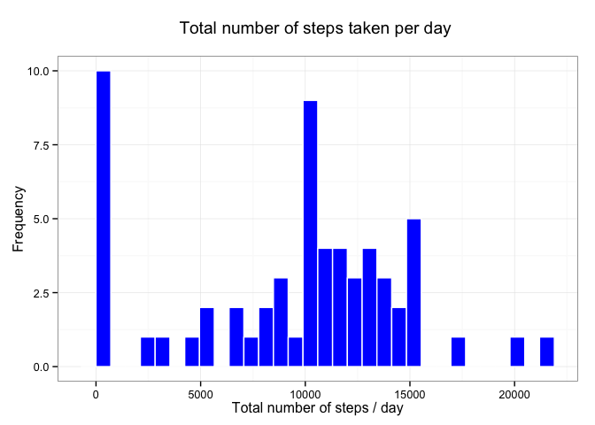
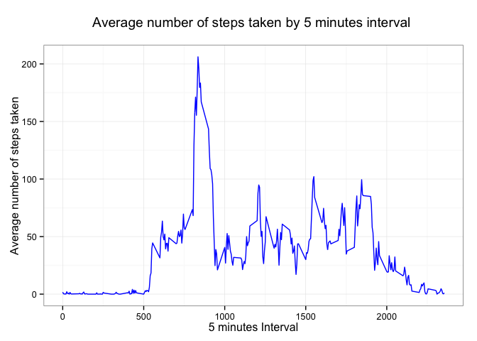

# Reproducible Research: Peer Assessment 1


## Loading and preprocessing the data

Show any code that is needed to

Load the data (i.e. read.csv())
Process/transform the data (if necessary) into a format suitable for your analysis

Loading the data:

```r
#Loading libraries
library(data.table)
library(ggplot2)

#Extracting and loading data into activityData dataframe
activityData <- read.csv(unz("./activity.zip", "activity.csv"))

# Process/transform the data (if necessary) into a format suitable for your analysis
# Setting data types
activityData$date <- as.Date(as.character(activityData$date),"%Y-%m-%d")

#Adding new columns
activityData$weekday <- weekdays(activityData$date)

#Activity data as "data.table"
activityData <- data.table(activityData,
                           key=c("date","interval","weekday"))
```

## What is mean total number of steps taken per day?

What is mean total number of steps taken per day?

For this part of the assignment, you can ignore the missing values in
the dataset.

Make a histogram of the total number of steps taken each day


```r
#Aggregating steps by date
stepsByDay <- activityData[,j=list(totalsteps=sum(steps, na.rm = TRUE))
                           ,by="date"]
#Histogram:
plot1 <- ggplot(stepsByDay,
               aes(totalsteps))

plot1 + geom_histogram(fill="blue", color="white") + 
    theme_bw() + 
    labs(x="Total number of steps / day",
         y = "Count",
        title = "Total number of steps taken per day")
```

```
## stat_bin: binwidth defaulted to range/30. Use 'binwidth = x' to adjust this.
```

 

Calculate and report the mean and median total number of steps taken per day

The mean of total number of steps taken per day is 9354.229508 .

The median of total number of steps taken per day is 10395 .


## What is the average daily activity pattern?
Make a time series plot (i.e. type = "l") of the 5-minute interval (x-axis) and the average number of steps taken, averaged across all days (y-axis)


```r
#Aggregating steps by interval
stepsByInterval <- activityData[,j=list(avgsteps=mean(steps, na.rm = TRUE))
                           ,by="interval"]
#Histogram:
plot2 <- ggplot(stepsByInterval,
               aes(x = interval,
                   y = avgsteps))

plot2 + geom_line(color="blue") +
    theme_bw() +
    labs(x="5 minutes Interval",
         y = "Average number of steps taken",
        title = "Average number of steps taken by 5 minutes interval \n averaged across all days")
```

 

The 5 minute interval with the maximum number of steps, on average across all the days in the database is 835.

## Imputing missing values

Note that there are a number of days/intervals where there are missing
values (coded as NA). The presence of missing days may introduce
bias into some calculations or summaries of the data.

Calculate and report the total number of missing values in the dataset (i.e. the total number of rows with NAs)

Total number of missed values in the dataset: 2304 .

Devise a strategy for filling in all of the missing values in the dataset. The strategy does not need to be sophisticated. For example, you could use the mean/median for that day, or the mean for that 5-minute interval, etc.

Create a new dataset that is equal to the original dataset but with the missing data filled in.


```r
#Average steps by weekday, interval 
stepsbyweekdayinterval <- activityData[,j=list(avgstepsfill=mean(steps, na.rm = TRUE)),
                                               by=c("weekday","interval")]

activityDataNN <- merge(x=activityData,
                               y=stepsbyweekdayinterval,
                               by=c("weekday", "interval"),
                               all.x = TRUE)

activityDataNN$steps[is.na(activityDataNN$steps)] <- activityDataNN$avgstepsfill[is.na(activityDataNN$steps)]

activityDataNN <- data.table(activityDataNN[,2:4,with=FALSE],
                                    key = c("date", "interval"))
```


Make a histogram of the total number of steps taken each day


```r
#Aggregating steps by date
stepsByDayNN <- activityDataNN[,j=list(totalsteps=sum(steps, na.rm = TRUE))
                           ,by="date"]
#Histogram:
plot1 <- ggplot(stepsByDayNN,
               aes(totalsteps))

plot1 + geom_histogram(fill="blue", color="white") + 
    theme_bw() + 
    labs(x="Total number of steps / day",
         y = "Count",
        title = "Total number of steps taken per day")
```

```
## stat_bin: binwidth defaulted to range/30. Use 'binwidth = x' to adjust this.
```

 

Calculate and report the mean and median total number of steps taken per day

The mean of total number of steps taken per day is 10821.209602 .

The median of total number of steps taken per day is 11015 .

Do these values differ from the estimates from the first part of the assignment? What is the impact of imputing missing data on the estimates of the total daily number of steps?

These values are different from the estimates from the first part


```r
#mean and median of total number of steps taken per day

firstvalues <- c(mean(stepsByDay$totalsteps),
                 median(stepsByDay$totalsteps))

lastvalues <- c(mean(stepsByDayNN$totalsteps),
                median(stepsByDayNN$totalsteps))

impact <- lastvalues - firstvalues

diffs <- as.data.frame(cbind(firstvalues, 
                                 lastvalues, 
                                 impact),
                           row.names = c("mean",
                                         "median"))

diffs
```

```
##        firstvalues lastvalues  impact
## mean       9354.23   10821.21 1466.98
## median    10395.00   11015.00  620.00
```

## Are there differences in activity patterns between weekdays and weekends?

For this part the weekdays() function may be of some help here. Use
the dataset with the filled-in missing values for this part.

Create a new factor variable in the dataset with two levels – “weekday” and “weekend” indicating whether a given date is a weekday or weekend day.
Make a panel plot containing a time series plot (i.e. type = "l") of the 5-minute interval (x-axis) and the average number of steps taken, averaged across all weekday days or weekend days (y-axis). 

Your plot will look different from the one above because you will
be using the activity monitor data. Note that the above plot was made
using the lattice system but you can make the same version of the plot
using any plotting system you choose.


```r
activityDataNN$weekdayweekend <- "weekday"

activityDataNN$weekdayweekend[weekdays(activityDataNN$date) %in% c("Sunday","Saturday")] <- "weekend"

activityDataNN$weekdayweekend <- as.factor(activityDataNN$weekdayweekend)

activityDataNN <- data.table(activityDataNN,
                                key=c("interval","weekdayweekend"))

stepsByWeekdayNN <- activityDataNN[,j=list(stepsaverage=mean(steps)),
                                      by=c("weekdayweekend","interval")]

plot3 <- ggplot(stepsByWeekdayNN,
               aes(x=interval,
                   y=stepsaverage))

plot3 + geom_line(color="blue") +
    theme_bw() +
    facet_wrap(facet = ~weekdayweekend,
               ncol = 1) +
    labs(x="Interval",
         y = "Number of steps",
        title = "Average number of steps taken by 5 minutes interval \n")
```

 

What is next?
